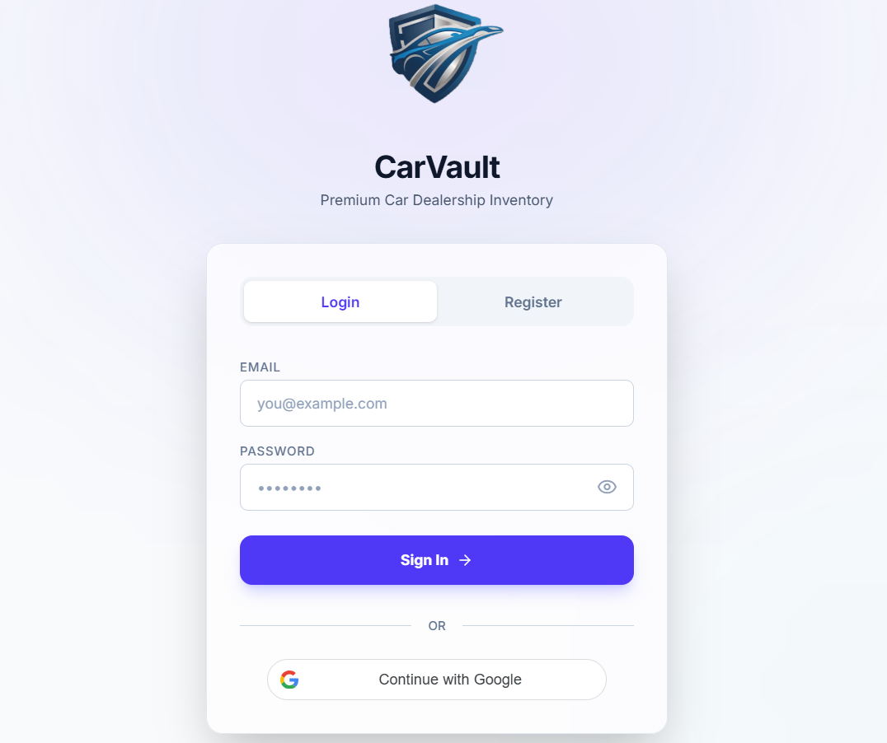
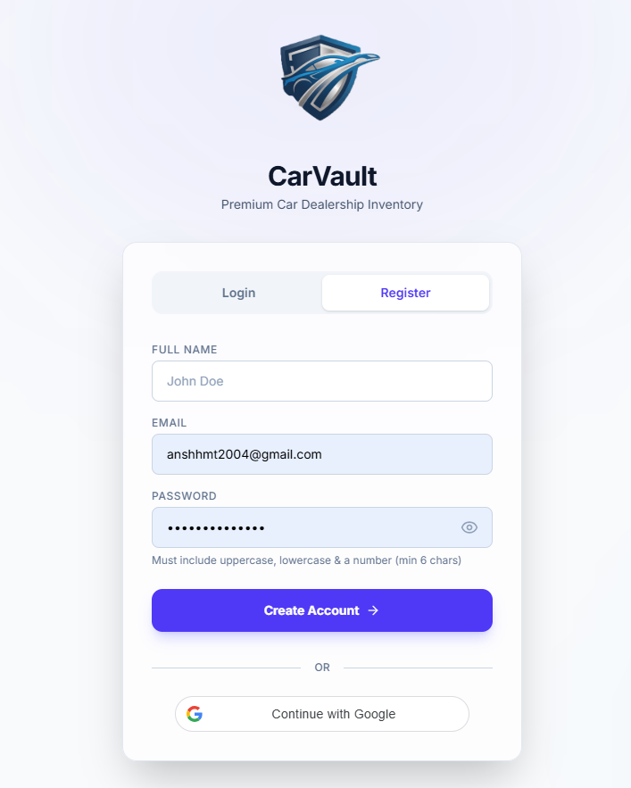
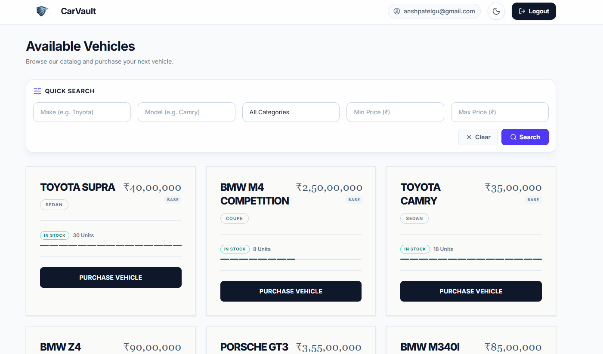
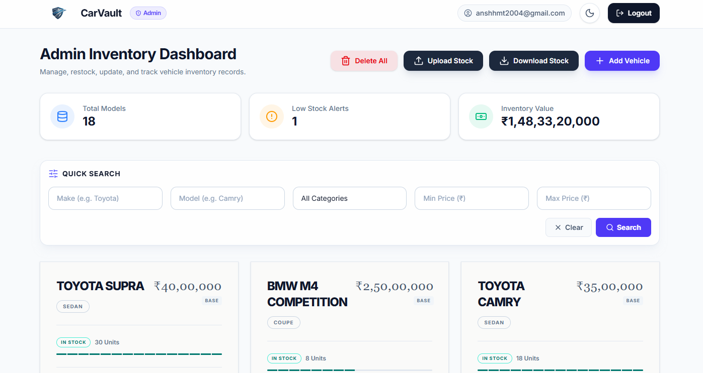
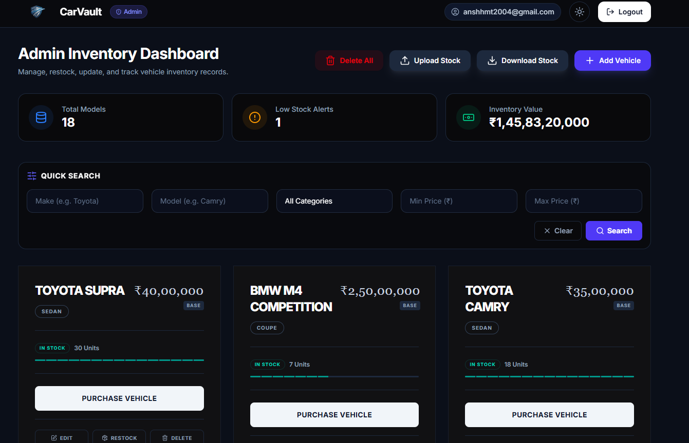
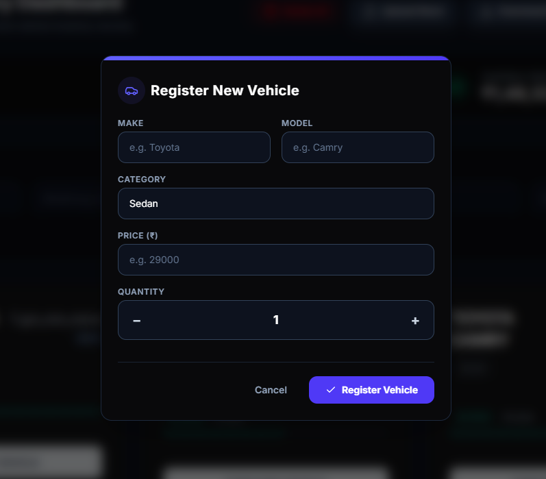
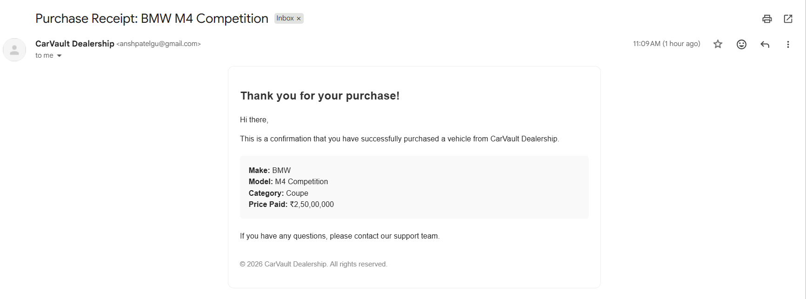

# CarVault - Car Dealership Inventory System

## Project Overview
CarVault is a full-stack Car Dealership Inventory System built with a Node.js/TypeScript backend and a React/Tailwind frontend. It provides robust tools for managing a premium car dealership's inventory
-> featuring role-based authentication (Admin/User)
-> Admin CRUD Operations on Vehicles
-> A live inventory dashboard
-> CSV import/export capabilities
-> Email notifications for purchases
-> Secure Google OAuth integration.

This project was built following strict Test-Driven Development (TDD) principles, with comprehensive test coverage using Vitest and MongoDB Memory Server.

## Features
- **User Authentication:** JWT-based login/registration, plus "Continue with Google" OAuth integration. Role-based access control (Admin vs User).
- **Inventory Management:** View, search, and filter vehicles by make, model, category, or price.
- **Admin Dashboard:** Full CRUD capabilities (Add, Edit, Delete, Restock) for inventory. Supports Bulk CSV Import and Export with deduplication algorithms.
- **Purchase System:** Users can purchase vehicles (decrementing stock) and automatically receive an email receipt.
- **Modern UI/UX:** Built with React, Tailwind CSS, and Framer Motion for smooth, premium animations and a beautiful responsive design.

## Tech Stack
- **Frontend:** React (Vite), TypeScript, Tailwind CSS, Framer Motion, Axios, React Hot Toast, React Router.
- **Backend:** Node.js, Express, TypeScript, MongoDB (Mongoose), JSON Web Tokens (JWT), Nodemailer (for receipts), Google Auth Library.
- **Testing:** Vitest, Supertest, MongoDB Memory Server.

## Installation & Setup

### Prerequisites
- Node.js (v18+)
- MongoDB instance (Local or Atlas)
- Google Cloud Console Web Client ID (for OAuth)

### Backend Setup
1. Navigate to the backend directory:
   ```bash
   cd backend
   ```
2. Install dependencies:
   ```bash
   npm install
   ```
3. Create a `.env` file in the `backend` root and configure the following variables:
   ```env
   PORT=5000
   MONGO_URI=mongodb://localhost:27017/car_dealership
   JWT_SECRET=your_super_secret_key
   ADMIN_SECRET=your_admin_secret_key
   GMAIL_USER=your_email@gmail.com
   GMAIL_APP_PASSWORD=your_google_app_password
   GOOGLE_CLIENT_ID=your_google_oauth_client_id
   ```
4. Run the development server:
   ```bash
   npm run dev
   ```

### Frontend Setup
1. Navigate to the frontend directory:
   ```bash
   cd frontend
   ```
2. Install dependencies:
   ```bash
   npm install
   ```
3. Create a `.env` file in the `frontend` root:
   ```env
   VITE_API_URL=http://localhost:5000/api
   VITE_GOOGLE_CLIENT_ID=your_google_oauth_client_id
   ```
4. Run the development server:
   ```bash
   npm run dev
   ```

## Test Report
The backend features a robust test suite ensuring rock-solid stability. 
To run the tests, navigate to the `backend` folder and run `npm run test`.
- **Test Files:** 7 passed (7)
- **Tests:** 97 passed (97)
- **Coverage:** 100% passing. Testing covers Models, Middleware, Services, and Controllers. (See `test-report.txt` in the root for details).

## Screenshots

- 
- 
- 
- 
- 
- 
- 

## AI Tools Used

This project was developed with the assistance of multiple AI tools, each used for different aspects of the development process:

- **Claude Sonnet 4.6 (Antigravity IDE):** Primary coding assistant for implementing features, debugging, refactoring, and writing tests.
- **Claude Opus 4.6 (Antigravity IDE):** Assisted with frontend development, UI/UX improvements, component design, and animations.
- **Gemini 3.5 Flash (Antigravity IDE):** Used for quick fixes, code refinements, and small implementation tasks.
- **Gemini 3.1 Pro (Antigravity IDE):** Served as an autonomous programming partner for feature development, architecture refinement, and iterative implementation.
- **ChatGPT 5.5 (Web):** Used for high-level architecture discussions, project planning, design reviews, documentation guidance, and implementation strategies.


### How I Used AI
- **Test-Driven Development & Boilerplating:** I instructed AI Models to adopt a strict TDD approach. They wrote comprehensive Vitest suites (with `mongodb-memory-server`) *before* implementing the services and controllers. It successfully scaffolded models, routes, and complex validation logic.
- **Frontend Architecture & Styling:** Gemini and Claude built the entire React frontend from scratch, strictly adhering to a premium aesthetic using Tailwind CSS and Framer Motion. It architected the Context API for authentication and the Axios interceptor logic.
- **Advanced Features & Integrations:** I used AI Models to incrementally add advanced features, including:
  - Bulk CSV Import/Export with CSV-parser and JSON2CSV.
  - Nodemailer integration for automated purchase receipts.
  - Full Google OAuth integration (`@react-oauth/google` and `google-auth-library`), complete with Vitest mocks and robust error handling.
- **Debugging:** When tests failed (e.g., a TypeError in Vitest when mocking the `OAuth2Client`), AI Models autonomously debugged the test runner and implemented the correct ES6 class mock.

### Reflection
The use of an agentic AI workflow fundamentally accelerated the development lifecycle. Instead of manually typing boilerplate CRUD endpoints or searching StackOverflow for optimal Vitest mocking strategies, I focused on high-level architecture, user experience, and feature requirements with use of the models.

The AI acted as a hyper-competent co-pilot, seamlessly bridging the gap between my instructions and the final implementation, whilst adhering rigidly to the TDD constraints I set. The transparent commit history (using the `Co-authored-by` git trailer) accurately reflects this collaborative process. A full transcript of the prompts used is available in `PROMPTS.md`.

### NOTE : This Documentation is AI generated and Was Reviewed Manually and Some Changes were Made by Me (Ansh)

